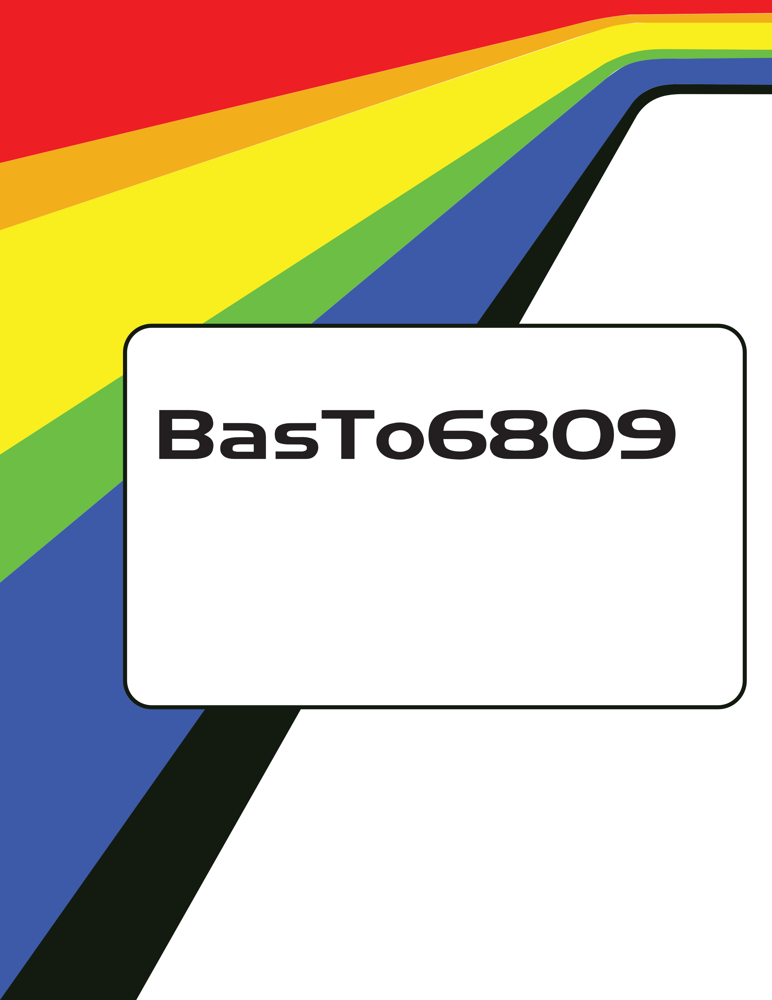

= Color Computer Basic Compiler
:filename: manual
:toc:
:toclevels: 3
:sectnums!:
:sectids!:
:sectlinks:
:setanchors:
:chapter-label:
:doctype: book
:revision: 3.01
:author: Glen Hewlett
:copyright: Copyright 2024
:encoding: utf-8
:lang: EN
:experimental:
:icons: font
:listing-caption: Listing
:pdf-page-size: [8.25in, 11.69in]
:title-page-background-image: 
:copyright: ©
:cpp: C++
:dot1: .
:ellipsis: …
:hatch: #
:pilcrow: ¶
:asterisk: *
:tilde: ~
:ul: _
:mu: µ
:ohm: Ω
:dot: •
:union: ∩
:degree: °
:held: ∆
:bar: |
:slash: \
:lte: < =
:gte: = >
:down: &#x2193;
:up: &#x2191;
:left: &#x2190;
:right: &#x2192;
:cb: Basic-to-6809
:ecb: Extended Color Basic
:tcb: Color Basic
:sourcedir: code
:source-highlighter: rouge

<<<

:numbered!:
include::manual.txt[]

